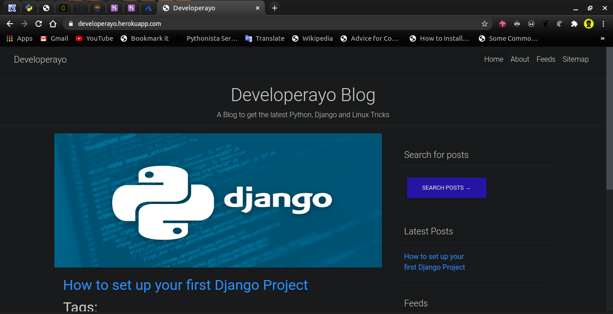

# Django-blog
Blog App that supports native comments, tagging system and other cool stuffs written in django.

## Blog features
Admin, customized model managers, pagination, share posts by email functionality, native comment system, tagging functionality,
similar posts retrieval, custom templates tags and filter, sitemap functionality(XML), 
feeds for blog posts(XML),full text search postgresql functionality, and 
few other cool stuffs.

## Installation
1. Clone this project on your machine 
1. `cd` into the dir
1. Install virtual environment `python3 -m pip install --user virtualenv`
1. Create your python virtual environment `python3 -m venv venv`
1. Activate venv `source venv/bin/activate`
1. Install requirements `pip3 install -r requirements.txt`
1. run `python manage.py makemigrations`
1. run `python manage.py migrate`
1. create superuser for admin access `python manage,py createsuperuser`
and follow the on-screen instructions to put your details
1. finally run `python manage.py runserver` and go to the local host

#NOTE:

To use full text search postgresql functionality, you must have postgresql
installed on your system and change your default project database settings in 
`settings.py`

from: 
```
DATABASES = {
    'default': {
        'ENGINE': 'django.db.backends.sqlite3',
        'NAME': os.path.join(BASE_DIR, 'db.sqlite3'),
    }
}
```
to:
```
DATABASES = {
    'default': {
        'ENGINE': 'django.db.backends.postgresql',
        'NAME': '<your_db_name>',
        'USER': '<postgresql_user>',
        'PASSWORD': '<your_db_password>',
    }
}

```
#Contributing
Please read [CONTRIBUTING.md](https://gist.github.com/developerayyo/f27fa2aad3e56e8f9c40537574846fca) for details on our code of conduct, and the process for submitting pull requests to us.

## Live on Heroku
*The Blog is also live on Heroku:* [here](https://developerayo.herokuapp.com/)




## Follow Developerayo

>twitter: [@developeryyo](https://twitter.com/Developerayyo)


>Linkedin: [Babalola Peter](https://www.linkedin.com/in/babalola-peter-689768163/)
